<h3><code>besirevic06@github ~ $ ./contributions.sh</code></h3>

  

<table>
<tr>
<td width="210" align="center" valign="middle"></td>
<td valign="middle"></td>
</tr>
</table>

<!-- Adapted from navi3582/animated-github-profile (MIT). Original license: scripts/LICENSE. -->

