<picture>
  <source media="(max-width: 600px)" srcset="./assets/profile-mobile.svg">
  
</picture>
  

<!-- Inspired by navi3582/animated-github-profile (MIT); original renderer license: scripts/LICENSE. -->
